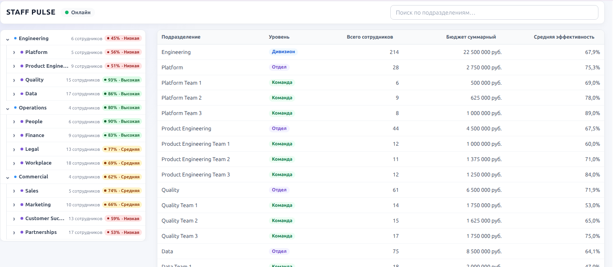
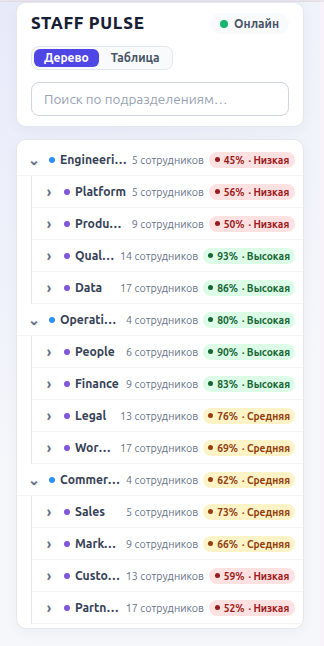
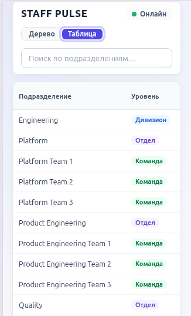

# Staff Pulse

Дашборд для мониторинга оргструктуры компании (дивизионы → отделы → команды). Интерактивное дерево и аналитическая таблица с агрегированными показателями, обновляемые в реальном времени по SSE.

### Desktop



### Mobile




## Стек

- React 19, Vite 8, TypeScript 6;
- TanStack Query — server state и кэш;
- Zod — runtime-валидация API boundary;
- styled-components — стилизация;
- Hono — mock API (REST + SSE);
- pnpm workspace (`apps/client`, `apps/server`).

## Требования

- Node.js 24.19.0;
- pnpm 12.4.1.

## Запуск

После клонирования выполнить одной командой:

```bash
pnpm install && pnpm dev
```

- Client: `http://localhost:5173`;
- Server: `http://localhost:3001`.

## Команды

```bash
pnpm build
pnpm --filter @staff-pulse/client lint
pnpm --filter @staff-pulse/client test
pnpm --filter @staff-pulse/server test
```

## API

- `GET /health` — состояние server;
- `GET /api/org-tree` — плоский массив из 51 узла оргструктуры (Division → Department → Team);
- `GET /api/org-tree/events` — SSE-поток realtime-обновлений (`node.updated` с полным `OrgNode`).

Client обращается к относительным путям `/api/*`; в development Vite proxy направляет их на Hono server.

## Реализовано

- интерактивное дерево: раскрытие/сворачивание, второй уровень по умолчанию, `name`/`headcount`/`performance`;
- аналитическая таблица: агрегированные `headcount`, `budget`, взвешенная `performance`, уровень узла;
- сортировка по всем колонкам (click → ASC, double click → DESC) и realtime-фильтр по названию (debounce 250 мс);
- двусторонняя синхронизация выбора строки ↔ узла дерева;
- realtime-обновления по SSE без полного refetch;
- инкрементальный пересчёт агрегатов (только изменённый узел и его предки);
- connection indicator (`connecting` / `online` / `reconnecting` / `offline`);
- ручной reconnect с exponential backoff (`1s → 2s → 4s → 8s → 16s → max 30s`) и race-safe resync после обрыва;
- keyboard navigation по таблице (`ArrowUp`/`ArrowDown`, `Home`/`End`, `Enter`);
- подсветка обновившихся ячеек, анимация раскрытия дерева, поддержка `prefers-reduced-motion`.

## Структура

```text
apps/
    client/    React, Vite, TanStack Query, Zod, styled-components
    server/    Hono mock API (REST + SSE)
docs/
    adr/       архитектурные решения (ADR)
    plans/     утверждённые планы реализации
    steps/     требования и границы этапов
```

Подробнее:

- [Архитектура](docs/architecture.md);
- [Модель данных](docs/data-model.md);
- [ADR](docs/adr/).

## Этапы

- `step/1 — FOUNDATION` — завершён и тегирован;
- `step/2 — CORE` — завершён и тегирован;
- `step/3 — POLISH` — завершён и тегирован;
- `step/4 — BONUS` — не создавался: BONUS не реализовывался.

## Что не реализовано

`step/4 — BONUS` (production-окружение и AI-поиск) сознательно не реализовывался:

- Docker / docker-compose / `.env`;
- Nginx / gzip;
- ограничение production bundle ≤200 КБ gzip;
- AI-поиск с fallback на текстовый поиск.

## AI в разработке

AI-инструменты использовались на всех этапах разработки:

- декомпозиция исходного задания на этапы (FOUNDATION / CORE / POLISH) и формулировка требований;
- сравнение вариантов архитектуры и фиксация решений (alias `@/*` vs `#server/*`, двухэтапная валидация API boundary, TanStack Query, `OrgSnapshot`, SSE, инкрементальные агрегаты) в `docs/decisions.md` и ADR;
- реализация по утверждённым планам (`docs/plans/*`) — server и client код;
- тесты (`node:test`) и проектная документация (`docs/*`, README).

Разработчик вручную:

- утверждал архитектуру и границы этапов;
- проводил code review и manual UX/realtime review;
- находил ошибки и отправлял точечные исправления.

Пример найденного и исправленного бага: в `orgTable.styles.ts` keyframes `highlightFade` интерполировался в обычную строку, из-за чего styled-components не инжектил `@keyframes` и подсветка обновившихся ячеек не работала; исправлено импортом `css` и обёрткой анимации в `css`-шаблон.

Существенные участки сгенерированного кода вручную не переписывались: после ревью код принимался с точечными правками, полной ручной переработки AI-кода не было.
